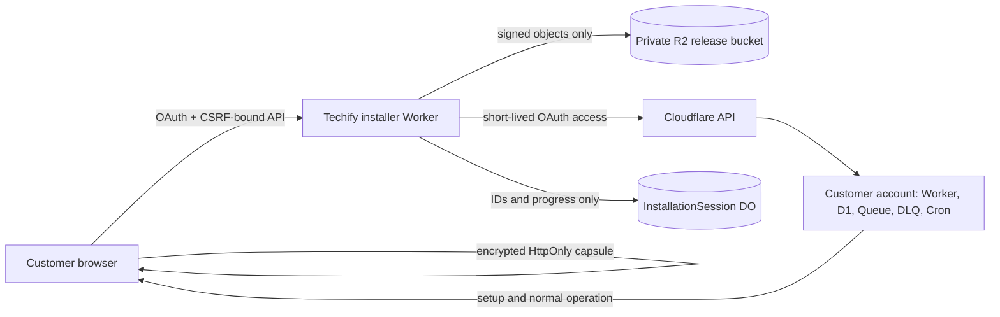

# Nexus Edge Cloudflare Installer Architecture

## Scope and invariants

Version 1 installs only the D1 deployment of Nexus Edge. It never switches to
PostgreSQL, never clones GitHub in a customer account, never builds application
code during installation, and never performs destructive rollback. An error in
a migration or binding stops the installation and preserves every resource
already created.

The customer chooses the target account and confirms the complete resource list
before the first write. The first administrator is created later at `/setup` in
the customer's own Nexus, not in the Techify installer.

## Trust boundaries



The OAuth access token and generated Core secrets exist only in an AES-256-GCM
browser capsule. The capsule is bound to a random browser value whose SHA-256
digest is stored with progress. The Durable Object refuses fields whose names
indicate tokens, credentials, passwords, cookies, authorization codes, or
secrets.

The truthful public statement is: “Techify does not receive your password and
does not store your tokens. A temporary Cloudflare authorization is used during
installation and revoked at the end.”

## Authorization and credentials

The installer uses Authorization Code flow with `state`, nonce, and PKCE S256.
The OAuth client secret exists only as a Worker secret. Callback and mutation
requests are same-origin, mutations require JSON plus a CSRF header, and the
session cookie is `__Host-`, `HttpOnly`, `Secure`, and `SameSite=Lax`.

The OAuth client must expose only the permission groups needed to:

- read the selected account and, when requested, its zones;
- create/query D1;
- create/configure Queues;
- upload and route Workers and static assets;
- configure Cron and a Queue consumer;
- attach the explicitly reviewed Custom Domain.

The initial installation does not request or create the permanent plugin
credential. When an administrator first opens the Core Plugins screen without
that credential, a guided dialog opens automatically. Its account-specific
Cloudflare template link prefills the `Nexus Edge Plugins` token name and only
Workers Scripts Write. The Core validates that the token can list Workers and
that D1 and Queue calls return authorization denials, then writes it directly to
its own `CF_API_TOKEN` Worker secret. The value is never stored in D1 or returned
by the API. A Global API Key is never accepted.

## Release integrity

CI builds Core modules, static assets, and ordered D1 migration artifacts once.
Every object is content-hashed and stored under an immutable version prefix.
`release.json` is canonical JSON; CI signs its SHA-256 digest with Ed25519. The
installer verifies the stable pointer, manifest hash, signature, minimum
installer version, each object size, and each object SHA-256 before use.

The release signing private key is CI-only. The installer receives only the
SPKI public key. `stable.json` is the sole mutable release object and is uploaded
only after immutable objects and the canary gate.

## Provisioning state machine

Each API request performs one bounded, retryable step. The Durable Object issues
a 45-second lease, preventing two browser requests from executing the same step
concurrently. Resource names include cryptographic entropy and preflight checks
retry collisions before any resource is created.

The principal path is:

```text
created → oauth_authorized → configured → preflight_complete
→ release_verified → d1_created → migrations_applied → queues_created
→ runtime_token_created → worker_uploaded → worker_route_enabled
→ cron_configured → queue_consumer_configured → custom_domain_attached
→ health_verified → oauth_revoked → completed
```

`runtime_token_created` is retained as a backwards-compatible internal
checkpoint, but no runtime token is created during that step. Sessions paused
at the former `runtime_token_required` state are advanced without a prompt.
`authorization_required`, `waiting_for_domain`, and `failed` retain an explicit
resume state. Creation calls first list existing resources by the session's
immutable names. D1 migrations use Wrangler's exact `d1_migrations` table
contract and a second hash ledger so changed historical migrations are
rejected.

## Retention and independence

An active session is retained for one hour. Completed metadata is retained for
at most 24 hours and then deleted by a Durable Object alarm. The final report is
limited to timestamps, release hashes, sanitized errors, masked account ID, and
resource names/IDs. It excludes headers, tokens, cookies, codes, secrets, and
database data.

After completion, the Core Worker, assets, D1, Queue, DLQ, and Cron reside in
the customer account. The plugin credential is added later to that same Core
Worker only if plugins are used. Turning off the Techify installer does not
affect the installed Nexus.
